  

 

  <b>Freelance IT Consultant · Infrastructure Builder · Open-Source Creator</b>
   
  Linux · Cloud · DevOps · Automation · Observability · Practical Software
    
  <a href="https://www.kasunindika.com"><b>Portfolio</b></a>
  &nbsp;·&nbsp;
  <a href="https://www.linkedin.com/in/kasundigital/"><b>LinkedIn</b></a>
  &nbsp;·&nbsp;
  <a href="https://github.com/kasundigital?tab=repositories"><b>Repositories</b></a>

---

## Hello, I'm Kasun 👋

I'm **Kasun Indika**, a Sri Lanka–based **Freelance IT Consultant** with **17+ years of hands-on experience** across systems administration, infrastructure, networking, cloud, automation and business technology.

I enjoy taking real operational problems and turning them into **reliable infrastructure, automation, monitoring systems and practical software**. My work ranges from Linux and Docker environments to observability stacks, deployment tooling, APIs, databases and self-hosted products.

> **I build systems that are useful in production — not just impressive in a demo.**

### What I work on

| Infrastructure | Automation | Observability | Products |
|---|---|---|---|
| Linux servers | Bash & Python | Grafana | Self-hosted apps |
| Docker platforms | Deployment tooling | Prometheus | SaaS products |
| Reverse proxies | APIs & integrations | Loki | Business systems |
| Cloud & networking | Backup workflows | Uptime monitoring | Open source |

---

## Featured Project

### 🚀 [GetStackPulse](https://github.com/kasundigital/getstackpulse)

**Free and open-source monitoring for websites, services and infrastructure.**

GetStackPulse is my current flagship open-source project — a self-hosted monitoring platform designed around **data ownership, organizations, workspaces, role-based access, audit logging and modern monitoring workflows**.

It is evolving beyond basic uptime monitoring toward broader server visibility, incident workflows and intelligent diagnostics.

**Project links:** [getstackpulse.com](https://getstackpulse.com) · [GitHub Repository](https://github.com/kasundigital/getstackpulse)

---

## Selected Open-Source Work

<table>
<tr>
<td width="50%" valign="top">

### [arr-lang-scanner](https://github.com/kasundigital/arr-lang-scanner)
Detect audio languages across **Sonarr and Radarr** libraries using MediaInfo, with movie, season and episode-level visibility.

`Python` `MediaInfo` `Sonarr` `Radarr` `Linux`

</td>
<td width="50%" valign="top">

### [Python App Deployer](https://github.com/kasundigital/python-app-deployer)
Server-side deployment utility for Python apps with dependency installation, port allocation and **systemd service creation**.

`Python` `Bash` `Linux` `systemd` `Automation`

</td>
</tr>
<tr>
<td width="50%" valign="top">

### [Jellyfin Exporter](https://github.com/kasundigital/jellyfin-exporter)
Monitoring-focused tooling around Jellyfin environments and infrastructure visibility.

`Jellyfin` `Monitoring` `Linux` `Observability`

</td>
<td width="50%" valign="top">

### [Trakt to Letterboxd](https://github.com/kasundigital/trakt-to-letterboxd)
Utility tooling for media-library workflows between Trakt and Letterboxd.

`Automation` `Media` `APIs` `Python`

</td>
</tr>
</table>

  <a href="https://github.com/kasundigital?tab=repositories"><b>Explore all public repositories →</b></a>

---

## Technical Toolbox

**Systems & Infrastructure**  
`Ubuntu` · `Debian` · `Windows Server` · `Proxmox VE` · `VMware ESXi` · `Docker` · `Docker Compose`

**Networking & Edge**  
`Nginx` · `Caddy` · `Cloudflare` · `DNS` · `SSL/TLS` · `VPN` · `Reverse Proxy`

**Monitoring & Observability**  
`Grafana` · `Prometheus` · `Loki` · `Netdata` · `Uptime Kuma` · `cAdvisor`

**Automation & Development**  
`Bash` · `Python` · `PHP` · `JavaScript` · `Node.js` · `REST APIs` · `Ansible` · `Git` · `GitHub`

**Data & Operations**  
`MySQL` · `MariaDB` · `PostgreSQL` · `Microsoft SQL Server` · `rclone` · `rsync` · `systemd` · `cron`

---

## Current Focus

- Building and growing **GetStackPulse**
- Linux and Docker infrastructure automation
- Monitoring, observability and operational dashboards
- Self-hosted software and SaaS products
- Deployment workflows and server-management tooling
- Practical AI-assisted automation and diagnostics

---

## GitHub Activity

  
  

  Statistics are generated inside this repository and refreshed automatically with GitHub Actions.

---

## Beyond Public Repositories

A large part of my work is production and client infrastructure that cannot be published publicly. This includes **server administration, cloud deployments, monitoring stacks, backup systems, business applications, media infrastructure, dashboards and automation workflows**.

For a broader view of my work, visit **[kasunindika.com](https://www.kasunindika.com)**.

---

  <b>Build reliable systems. Automate repetitive work. Make operations visible.</b>
    
  <a href="https://www.kasunindika.com">kasunindika.com</a>
  &nbsp;·&nbsp;
  <a href="https://www.linkedin.com/in/kasundigital/">LinkedIn</a>
  &nbsp;·&nbsp;
  <a href="https://github.com/kasundigital">GitHub</a>

